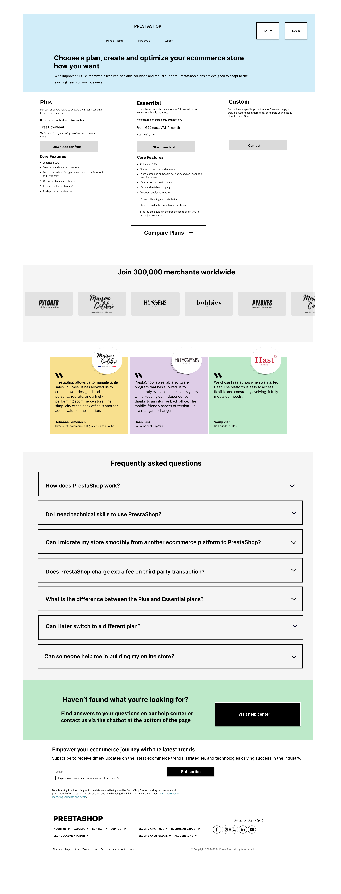

# PrestaShop offers Page Redesign

## Overview

This case study explores the redesign of PrestaShop's Offers page, with a focus on helping users better understand the differences between its product options and choose the solution that best fits their needs.

**My Role:** UX Content Designer  
**Focus:** Content Design, UX Writing, User Research, Information Architecture, Usability Testing

## The Challenge

Users needed to understand the differences between PrestaShop's available offers and determine which option was right for them. The existing experience created opportunities to improve how information was structured, explained, and presented.

The goal was to make the experience clearer and help users make more informed decisions with less confusion.
## Research & Discovery

To understand where users were experiencing confusion, I reviewed the existing Offers page and explored how users interpreted the different product options.

The research included:

- User interviews to understand expectations and decision-making
- Card sorting to explore how information could be grouped more intuitively
- Observation of user behaviour to identify areas of hesitation, confusion, and misclicks
- Testing different content and page approaches to understand which communicated the offers more clearly

## Key Insights

The research highlighted several content challenges:

- The distinction between the different PrestaShop offers was not immediately clear.
- Some users interpreted the Classic option as completely free without fully understanding what was included.
- The Hosted option and its 14-day trial needed clearer communication.
- Users needed an easier way to understand which solution was appropriate for their needs.

These findings showed that the problem was not simply about rewriting individual pieces of copy. The content hierarchy and the way the offers were explained also needed to be reconsidered.
## Content Strategy & Design Decisions

Based on the research findings, I focused on making the offers easier to understand, compare, and act on.

### 1. Clarifying the product options

I reviewed how each offer was described and focused on communicating the differences more clearly. The goal was to help users understand what each option included and who it was designed for.

### 2. Improving content hierarchy

I reorganized information so that the most important details appeared earlier in the decision-making process. Supporting information was placed where users could access it without overwhelming the main experience.

### 3. Reducing ambiguity

I identified language that could lead to incorrect assumptions, particularly around pricing, trials, and what was included with each offer. The revised content aimed to set clearer expectations before users made a selection.

### 4. Supporting comparison

Rather than treating each offer as an isolated piece of content, I considered how users would compare the options. Labels, descriptions, supporting information, and calls to action were designed to work together to make those differences easier to scan.
## The Solution

The redesigned Offers page helps users understand PrestaShop's different options, compare what each plan provides, and choose a path based on their needs and level of technical experience.

### Key Content Design Decisions

#### 1. Make the plans easier to understand

The offers were organized into three clear options: **Plus, Essential, and Custom**. Each plan begins with a short description explaining who it is intended for, helping users identify the most relevant option before reviewing the details.

#### 2. Set clearer expectations around pricing

Pricing information is presented prominently alongside important conditions and additional costs. For example, the Plus plan explains that users will still need to purchase hosting and a domain, while Essential communicates its monthly price and free trial.

This gives users important information earlier in the decision-making process.

#### 3. Use action-specific CTAs

Each plan uses a call to action that reflects what happens next:

- **Download for free** for Plus
- **Start free trial** for Essential
- **Contact** for Custom

Instead of using the same generic CTA across all three plans, the language sets a clearer expectation for the next step.

#### 4. Support quick scanning and comparison

The Plus and Essential plans use a consistent content structure, including plan description, transaction information, pricing, CTA, and core features.

A separate **Compare Plans** option gives users another way to examine the differences when they need more detail.

#### 5. Build trust around the decision

Merchant logos and testimonials provide social proof after users have reviewed the plans. This supports the decision-making journey without competing with the primary plan information at the top of the page.

#### 6. Anticipate questions before users leave the page

The FAQ addresses questions that could prevent users from choosing a plan, including:

- Technical skill requirements
- Migration from another ecommerce platform
- Third-party transaction fees
- Differences between Plus and Essential
- Switching plans
- Support with building an online store

#### 7. Provide a path when the page is not enough

Users who still cannot find the information they need are directed to the Help Center or chatbot rather than reaching the end of the page without a next step.

## Research, Testing & Validation

I used conversation mining, user interviews, and A/B testing to identify content problems and validate key decisions. Testing involved 7 users.

### Conversation Mining

I analyzed conversations in the PrestaShop community forum to understand the questions, frustrations, and language users used when discussing PrestaShop's offers.

The research revealed recurring issues around plan naming, technical requirements, support, customization, scalability, SEO, and choosing the right solution.

These findings influenced both the language and information architecture of the redesigned experience.

### User Interviews

User interviews helped uncover how people interpreted the existing offers and what information they needed when deciding between them.

One important finding was that users perceived **Custom** as a service rather than a distinct offer. In response, I separated Custom from the two primary offers and positioned it as an alternative path for users with more specific business needs.

### A/B Testing

A key issue identified through conversation mining was the naming of the existing **Classic** and **Hosted** offers.

I tested the existing names against proposed alternatives with 7 users:

- **Classic → Plus**
- **Hosted → Essential**

The test indicated that the proposed names communicated users' expectations of the offers more clearly and reduced the risk of one option appearing less valuable than the other.

## From Research to Content Decisions

### Clarifying who each offer is for

The existing experience used a **“Recommended”** label, but this did not explain who the recommendation was intended for.

I replaced this approach with **“Best for...”** messaging to give users more meaningful guidance based on their needs.

### Making support easier to find

Conversation mining showed that users found it cumbersome to locate support.

I increased the visibility of support within the redesigned experience and provided clearer routes to additional help through the Help Center and chatbot.

### Using the language of users

Terms including **SEO, customization, and scalability** appeared in the language users used when discussing their ecommerce needs.

I incorporated this terminology into the page content so that the experience better reflected users' priorities and vocabulary.

### Expanding the FAQs

The redesigned FAQs were informed by conversation mining, competitor benchmarking, and user interviews.

Rather than limiting the section to general product information, the FAQs address questions that could influence a user's decision, including technical skills, migration, transaction fees, switching plans, and getting help to build a store.

### Creating a more conversational newsletter experience

The existing newsletter content placed formal consent language directly beneath **“The latest ecommerce trends,”** creating an experience that felt more technical than encouraging.

I revised the content hierarchy and introduced more conversational supporting copy while keeping the necessary consent information available. This better aligned the experience with PrestaShop's intended shift toward a more incisive and empowering tone of voice.

### Maintaining content consistency

I changed **“Log in”** to **“Sign in”** to maintain terminology consistency across the experience and align the interface copy with the writing guidance used for the project.
## Outcome & Reflection

The project demonstrated how content design can address more than individual pieces of copy. Research revealed that users' difficulties were connected to naming, information hierarchy, findability, and the way the different offers were positioned.

By combining conversation mining, user interviews, competitor benchmarking, and testing with 7 users, I was able to move from assumptions about the content to decisions grounded in user evidence.

The final concept:

- Created clearer distinctions between the primary offers
- Reframed plan recommendations around user needs
- Made important information such as pricing and technical requirements easier to find
- Improved access to support
- Expanded FAQs around questions identified during research
- Used language that more closely reflected how users discussed their ecommerce needs

### What I Learned

One of my biggest takeaways from this project was that content problems are not always solved by rewriting copy.

In this case, clearer language mattered, but so did naming, information architecture, hierarchy, and placement. Testing also reinforced the importance of validating terminology with users rather than assuming that internal product names will make sense to them.
